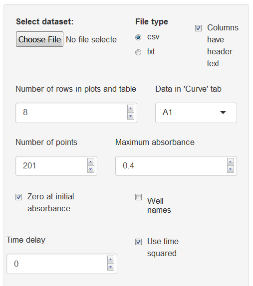
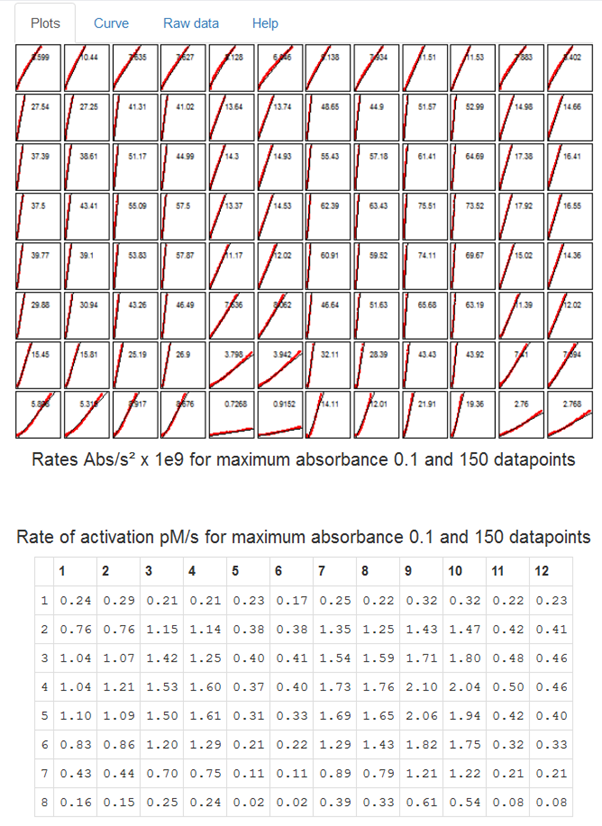
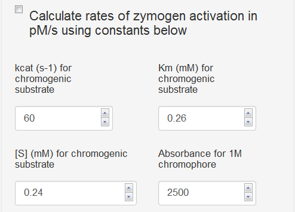

# Notes for calculating rates of zymogen activation using a chromogenic substrate

```{r, echo=FALSE}
knitr::opts_chunk$set(echo=FALSE)
```

A help tab in the app summarises the main features of zymogenactnCL version 0.6.  More details are presented below.

#The *Plots* tab

###Data Entry

A set of data is provided and is automatically read and analysed when the program starts.  The substrate hydrolysis curves generated can be explored to get a feel for using the various options discussed below.  However, the main use for the App is to facilitate analysis of user data.

Time course data, exported from a plate reader for example, should be formated as a single column of time in column 1 followed by columns of absorbance data.  The program detects the length and width of the data so there is no need to specify these dimensions.  Data can be read as csv or txt files, options which are specified using the check boxes in the left hand panel.  It is also necessary to specify if the columns have header text ("Time", well names "A1", "A2"... etc).  

__Note:__ *it is important not to leave empty cells, incomplete columns or rows, or spaces in names of column headers in any data files.  Gaps and spaces are the main reasons the program fails to read data or complete an analysis.*

Below is an example of a few rows of data to show how it should be formatted (and how it should appear in the *Raw data* tab).  


```{r}
#Data read from a text file with columns labelled Free and Bound (saved from your Excel spreadsheet for example)

Res<-read.csv("Feb 10 tPA variants.csv", header=TRUE)
#Res<-read.table("Dec13 chrom 1.txt", header=TRUE)
#Rows<-c(1, 3,5,7,9,11,13,15,17,19)
Cols<-c(1, 20, 21, 22, 23, 26, 27, 28, 29, 30)
#Res1<-Res[Rows,c(1, 20, 21, 22, 23, 26, 27, 28, 29)] # The data file has 20 points but you can use fewer by reducing the 
Res1<-Res[1:21,Cols ]
library(pander)
pander(Res1, row.names=FALSE) #Shows what's in the data table, top few points
```

Note that the Time column is labelled *Time_s*, which is fine, but *Time s* would not work due to the space.

###Graphing the data

The graphical output in the main panel of the opening page is organised by number of rows specified, using the *Number of rows in plots and table* numerical input box.  Curves in the panels are modified by *Number of points* and *Maximum absorbance* inputs.  The *Data in 'curve' tab* input selects the individual plot and fit that can be scrutinised in the second tab labelled *Curve*.  

The next set of options are self-explanatory: *Zero curves at initial absorbance*, and *Well names* to display the column headers in the results table.  The *Use time squared* checkbox is used to toggle between time or time squared on the x-axis. In either case a line of best fit through the data points is generated.

If the *Use time squared* checkbox is unchecked, the app can be used to simply calculate rates fo chromogenic substrate hydrolysis (or any other simple time course reaction).  Time squared is selected if the an enzyme is being generated that hydrolyses a chromogenic substrate to give the characteristic exponential curve.


The options to limit the absorbance and number of points, (in combination with scrutinising individual fits, residuals and r squared values) are all helpful to help get the best analysis possible.

An option is included to add a time delay, which is the time between initiating your reaction and taking the first reading (if this is not already present in the data file).  The time delay does not affect calculation of slopes where time is used as the independent variable; but it does affect calculations when time squared is used.  You can use this *Time delay* option to explore how significant these effects are on your results and take appropriate action.  For instance, is the time difference in starting reactions across a microtitre plate likely to affect your results? 

```{r out.width="200px"}

```


The supplied data give an output as shown below for initial zymogen activation rates and accompanying hydrolysis of chromogenic substrate.  As usual with enzyme reactions you should aim to use as little substrate as possible and measure initial rates.  This applies to both substrates in a zymogen activation reactions: the pro-enzyme and the chromogenic substrate.  As substrate is used up over time, reaction rates slow.  Slowing will happen sooner at faster reaction rates and results will therefore be skewed, so that faster rates will be affected more than slower reactions, which will be closer to the true initial rate values.  Careful use of options to reduce the number of points used and limiting the maximum absorbance will limit artefacts caused by substate depletion.



Graphs and results table can be copied to the clipboard by highlighting and right-clicking using the mouse. If you download and run the ui.R and server.R files locally in RStudio, you can search for the line of code in the Results Table section of the server.R file that contains "clipboard" and remove the # from the beginning of the line.  If this line of code is active, the contents of the table are automatically placed in the clipboard and can be pasted directly elsewhere for further analysis.

###Calculating rates of zymogen activation in pM/s

An option is provided that converts rates of absorbance change, calculated from plots of absorbance versus time squared, into zymogen activation rates in pM/s.  The calculation is triggered using the *Calculate rates of zymogen activation in pM/s using the constants below* check box in the left panel, but only works if the *Use time squared* check box is also ticked.  It should be noted that the results presentation is optimised for expected rates of chromogenic substrate hydrolysis which is why rates of of simple absorbance change are in **Abs/s x 1e6** and absorbance change versus time squared are shown as **Rates Abs/$s^2$ x 1e9**,to provide a print out that is easier to read.


```{r out.width="200px"}

```


The calculation that converts slopes of plots of absorbance versus time squared is outlined in earlier publications, e.g. [1,2,3]. In an ideal system without any substrate depletion,  absorbance due to chromogenic substrate hydrolysis is described as $$ Abs = \frac{\varepsilon . B . v . t^2}{2} + R$$

In this case $\varepsilon$ refers to the extinction coeficient of the chromophore under the operating experimental conditions. In our experience, in 100 µl of reaction in a microtitre plate, 1M pNA would have an absorbance of 2000-3000. B describes the kinetic parameters of the generated enzyme on the chromogenic substrate in the reaction. 
$$B = \frac{k_{cat(S)} .  [S]}{K_{m(S)} + [S]}$$

and $v$ is the rate of zymogen activation (the object of interest)

$$v = \frac{k_{cat(zym)} . [E_o] . [Zym]}{K_{m(zym)} + [Zym]}$$

$R$ is included to describe background rates of hydrolysis of chromogenic substrate, for instance by the activator (not the generated enzyme) or contaminating enzymes or due to unstable chromogenic substrate.

Ignoring these background rates for the moment, it can be seen that a plot of $Abs$ versus $t^2$ will have a

$$slope = \frac{\varepsilon . B . v }{2}$$

so to calculate $v$

$$ v = \frac{slope . 2}{\varepsilon . B }$$

The default settings in the app were determined for data in the provided data set where generation of plasmin  hydrolyses the substrate S-2251 with the following parameters:

$$
\begin{aligned}
k_{cat(S)} &= 60 s^{-1}  \\
K_{m(S)} &= 0.26 mM \\
[S] &= 0.24 mM \\
\varepsilon &= 2500 Abs.M^{-1}\\
\end{aligned}
$$
Therefore we can calculate $B=28.8 s^{-1}$ and the expression $\dfrac{\varepsilon . B}{2}= 36000$ with units of $Abs.M^{-1} . s^{-1}$

In a plot of $Abs$ versus $t^2$ the slopes (in units of $Abs . s^{-2}$) are divided by 36000 to give the rate of zymogen activation in $pM . s^{-1}$

In your own system, concentrations, kinetic parameters and extinction coefficients will differ and you should calculate your own values and insert them in the input boxes.

Further care is needed if flourescent substrates are used, for example, where the scale of the numbers used may be very different.

It should also be noted that these calculations have ignored $R$ which may be significant in your system.

###Results table

The results table (also shown in the figure above), corresponds to the graphical layout and displays the results in **Abs/s** or **Abs/$s^2$** if the *Use time squared* box is ticked, or in **pM/s** if both the *Use time squared* box is ticked and the *Calculate rates of zymogen activation in pM/s* box is ticked.


#The *Curve* tab

The curve tab allows the user to focus on a single curve, which is selected from the box labelled *Data in 'Curve' tab*.  

By default the plot shown is Absorbance versus time or versus time squared, depending on the settings in the left hand panel. The calculated value of rate is shown as a figure heading.  However, there is also an option to select a resdiduals plot to check for systematic deviations between the data points and the linear regression.  In the case the heading also shows the adjusted R-squared value as a measure of the goodness of fit.

#The *Raw data* tab

On this tab the name of the data file loaded is shown alongside the raw data as a table for inspection.  It is possible to click through pages of data using boxes at the foot of the page and to show data from start to end or in reverse.

#The *Help* tab

The *Help* tab summarises these help notes and provides citation details.

R code, data and help files are available from:
https://github.com/drclongstaff/zymogenactn06Repo

This repository also contains a small set of simulated data for a zymogen activation reaction in the presence of chromogenic substrate.  Results were analysed using the App and plots of Abs versus $t^2$ and compared directly with the simulation output of total Enzyme versus $t$.

More information and links may be found at 
http://www.nibsc.org/science_and_research/biotherapeutics/haemostasis/fibrinolysis.aspx

#References
1. Ranby M. Studies on the kinetics of plasminogen activation by tissue plasminogen activator.  *Biochim Biophys Acta*, 704(3), 461-9, 1982
2. Longstaff C et al, Kinetics of plasmin activation of single chain urinary-type plasminogen activator (scu-uPA) and demonstration of a high affinity interaction between scu-PA and plasminogen, *J Biol Chem* 267(1), 173-9, 1992
3. Longstaff C et al, A comparison of cultured cells with other promoters of tissue plasminogen activator kinetics, *Fibrinolysis*, 9, 178-87, 1995